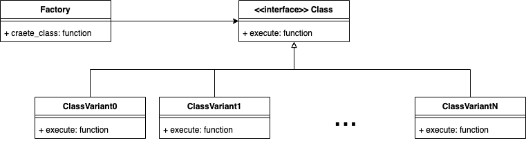

# Factory Pattern!

In this repo you'll see an example of the Factory pattern written in ruby.

## What is the factory pattern

On a highlevel, the factory pattern is the creation of some support classes that enable the programmer a choice between different implementations of an interface.

## UML diagram

## In this example

### The problem

Suppose that a small team of developers is creating scripts to leverage an API that offers different metrics of an app. In `first_iteration.rb` the team starts by simply making a request to the `/power` endpoint and processes the metric data without many issues.

Management amazed by the ability of the programming team then asks them to also fetch and process data from the `/revenues` endpoint. The team being clever and wanting to reuse the code they did for the first iteration, make some changes and manage to get the thing done in `second_iteration.rb`.

The development team's bosses are beyond stunned by the team and ask them to get the data from `/reviews` and `/downloads`. The team still believe in best practices and try to reuse their script, however due to the nature of the responses of the endpoints, they are forced to add some conditionals to parse it correctly.

The team is not satisfied anymore with the code quality of their script. As you can notice it has several problems. If management want more metrics, they will need to start adding more conditionals and they will need to scratch their heads to see if they don't break existing code. Also, if the API changes and they need to adapt their code, the team is in big trouble, as the script is not very forgiving.

But it is fixable!

### The solution using the pattern

Inside the `factory-example` folder you will find a more elegant solution to the problem the team was facing. Yes it uses the factory pattern, how did you know?.

For this example, we could have a *supoprt class* for each metric, a *metric class* to be the interface and *a factory* to produce the aftermentioned support classes. In ruby its not uncommon to have the interface class be mixed with the facotry (kill two birds with the same stone), but there are some purists that don't like that. If you are one of said purists you can `git checkout metric-factory-alternative`.

If you go into `main.rb` you'll see that the code is very staright forward; for each metric we ask the common interface to `put_information`. Then in `classes/metric.rb` we make the decision of which child to create and finally we make the call to said child.

The advantage of this approach is that the addition of new behavior (that is if we want to add more metrics) is fairly straightforward. We would simply need to create a new class. Another advantage is that if we want to make changes to an existing class we can also do that by simply changing the individual methods. Remember that inheritance can also give us the benefit of DRY if we want to. In this example, the whole make and fetch the response from the api is in the parent class.
